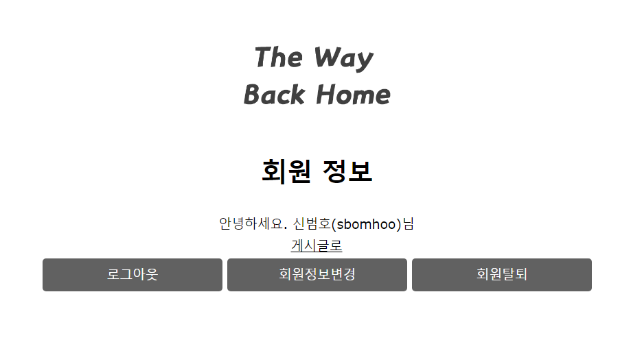

# The Way Back Home(TWBH)

MVC MODEL2로 구현한 JSP/Servlet 커뮤니티 
  
***


TWBH 구현 기능
-------------
-  로그인, 회원가입, 회원 정보 수정, 회원 탈퇴
-  게시글 입력,수정,삭제
-  페이징 처리
-  글 입력시 사진 업로드
-  답변글 달기
-  댓글 입력
-  좋아요 구현(Jquery Ajax 사용)

개발 환경 및 기술
-------------
- eclipse
- apache-tomcat-8.0.46
- oracle 11g:xe
- jsp/servlet 
- javaScript
- EL / JSTL
- w3.css
- jquery
- Ajax

WEB-INF/lib 추가
-------------
-  cos.jar  //사진 업로드를 위한 라이브러리
-  jstl.jar //jstl
-  standard.jar //EL
-  ojdbc.jar  //oracle db
-  json-simple-2.1.2.jar // ajax json 방식으로 통신하기 위함

server.xml 데이터베이스 커넥션 풀 추가 내용
-------------
```html
 <Context docBase="TWBH" path="/TWBH" reloadable="true" source="org.eclipse.jst.jee.server:TWBH">
         <Resource auth="Container" driverClassName="oracle.jdbc.driver.OracleDriver" loginTimeout="10" maxActive="50" maxIdle="20" 
         maxWait="5000" name="jdbc/myoracle" username="아이디" password="패스워드" testOnBorrow="true" type="javax.sql.DataSource"
         url="jdbc:oracle:thin:@127.0.0.1:1521:XE" />
      </Context>
```


회원 table db 쿼리문
-------------
<pre><code>
create table member(
  name varchar2(30) ,
  userid varchar2(30) primary key,
  pwd varchar2(30) not null,
  email varchar2(30),
  phone varchar2(30),
  admin number(1) default 1
);
</code></pre>


게시판 table db 쿼리문
-------------
<pre><code>
create table board(
  num number(5) primary key,
  name varchar2(30),
  email varchar2(30),
  title varchar2(50),
  content varchar2(1000),
  readcount number(4) default 0,
  img varchar2(100),
  ref number(5) default 0,
  indent number(5) default 0,
  step number(5) default 0,
  writedate DATE DEFAULT sysdate,
  comment_count number(10) default 0,
  like_it number(10) default 0,
  CONSTRAINT fk_name FOREIGN KEY(name) REFERENCES member(userid) on delete cascade   //on delete cascade 회원탈퇴시 관련 게시글 모두 삭제
);

create sequence board_seq  start with 1 increment by 1;
</code></pre>


댓글 table db 쿼리문
-------------
<pre><code>
create table board_comment(
  comment_num number(5) primary key,
  board_num number(5),
  userid varchar2(30),
  content varchar2(600),
  writedate DATE DEFAULT sysdate,
  CONSTRAINT FK_comment FOREIGN KEY(board_num) REFERENCES board(num),
  CONSTRAINT FK_name2 FOREIGN KEY(userid) REFERENCES member(userid)
);

create sequence comment_seq start with 1 increment by 1;
</code></pre>

***
구현 화면
-------------

**<전체적인 구조>**  
  
-  com.twbh.board.controller  : (게시판 관련) 1개의 서블릿(BoardServlet)이 커맨드를 받아 ActionFactory에 보낸다.
-  com.twbh.board.controller.action : controller로부터 받은 커맨드들을 각 커맨드에 맞게 클래스에서 수행한다. 
  각 클래스들은 인터페이스인 Action을 구현한다.
-  com.twbh.common.dao : DAO 데이터베이스 관련 작업을 수행
-  com.twbh.common.dto : DB에서 넣거나 가져온 데이터를 담아두는 역할 
-  com.twbh.member.controller : (회원관리 관련) 컨트롤러
-  util : DB 커넥션, 클로즈 

  
  
-  index.jsp : 첫 시작 화면, 로그인form
-  /board/ : 게시판 관련 jsp 모아놓은 폴더
-  /css/  : 게시판과 회원관리 관련 css 폴더
-  /img/  : jsp에 사용된 로고,사진들 저장해놓은 폴더
-  /upload/ : 사용자로부터 입력 받은 사진들 저장해놓은 폴더
-  /member/  :  회원관리 관련 jsp들모아놓은 폴더
-  /script/  : ajax, 유효성 검사를 위한 자바스크립트들을 모아놓은 폴더
  

**<index.jsp>**  
  
- jquery를 이용해 이미지 위에 마우스가 올라가면 움직이는 효과를 줌.

  
**<회원가입>**   
  
  

**<회원가입_아이디중복확인>**   
  
- java script(member.js) 이용하여 유효성검사를 실시 
  
  
**<회원가입_유효성검사>**  
  
- java script(member.js) 이용하여 유효성검사를 실시  
  

**<게시판 리스트>**  
  
-  게시글 제목 옆에 주황색 대괄호로 게시글의 댓글 갯수를 나타나게 구현  
  
**<내 정보>**  
  

  
**<회원정보수정>**  
  
  
  
**<회원 탈퇴>**  
  
  

**<글 쓰기>**  
  
-  글 입력시 multipartRequest를 사용하여 이미지도 같이 업로드 할 수 있게 구현
-  이미지는 img폴더안에 저장이 되고 DB에는 이미지명과 확장자를 저장해둔다.
-  게시글을 쓰기 위해서는 request 값을 두번 받아야하는데(커맨드와 폼입력값) 
-  multipartRequest를 사용하니 값을 두번 가져올 수가 없어서 session을 통해 커맨드 값을 보내줌.  
  

**<내가 쓴 글 보기>**  
  
-  댓글 기능 구현
-  JSTL과 EL을 사용하여 자기가 쓴 글만 수정,삭제 버튼이 보이도록 구현
  

**<남이 쓴 글 보기>**  
  
-  남이 쓴 글에는 수정,삭제 버튼이 나타나지 않음
  
    
**<좋아요 클릭>**  
  
  
    
**<좋아요 update>**  
  
-  ajax를 이용하여 페이지 이동 없이 좋아요를 누를 수 있도록 구현
-  좋아요를 누르면 board.js의 like함수를 호출해 ajax.serialize()를 이용하여 서버단으로 데이터를 보냄
-  서버단에서 DB에 좋아요 값을 update하고 성공시 alert창을 띄어 사용자에게 알리고   
-  view단에 아이디 값인 like_result div의 값을 수정된 값으로 변경  


**<답글 쓰기1>**
  
  

**<답글 쓰기2>**  
  
- 답글 저장시 db에서 부모의 글번호를 ref로 저장하고 요청된 ref와 같은 데이터의 step을 1씩 증가 시킴  
- 게시판 list에서 불러올 때 ref를 내림차순 기준으로 정렬을 하고 만약 ref가 같으면 step을 오름차순 기준으로 정렬함  
  
  
**<게시글 삭제>**  
  
  
   
**<게시글 수정 Form>**  
  
  
  
**<게시글 수정 후>**  
  
- 사진이 추가 / 제목 변경 / 글 '수정본'이라는 글씨 생김  

  
